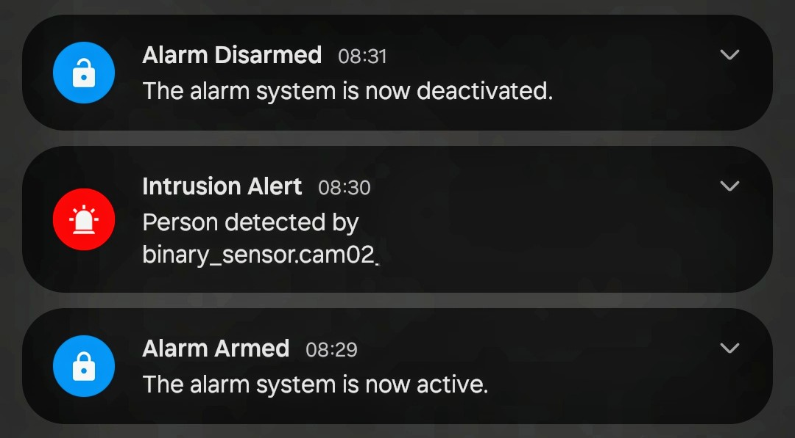
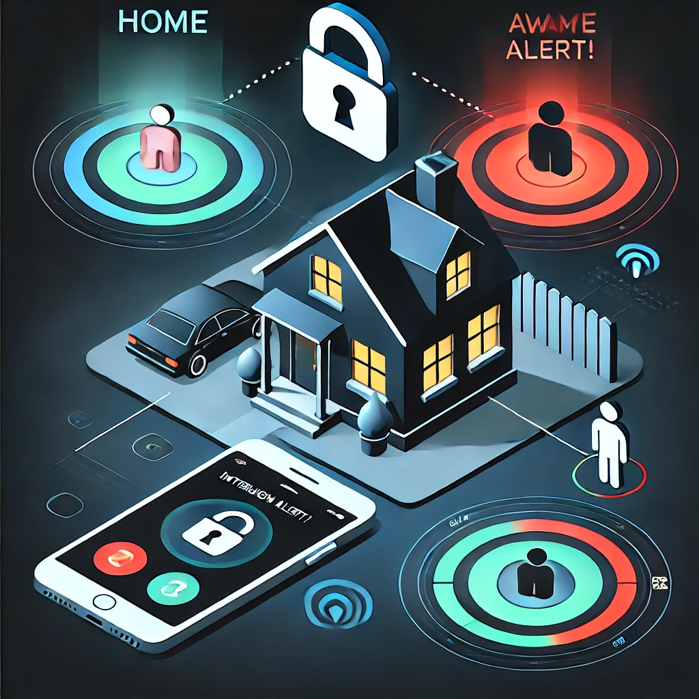
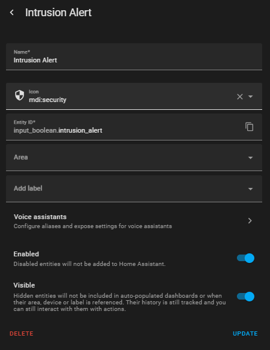
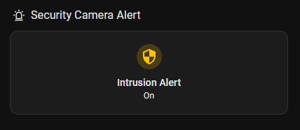
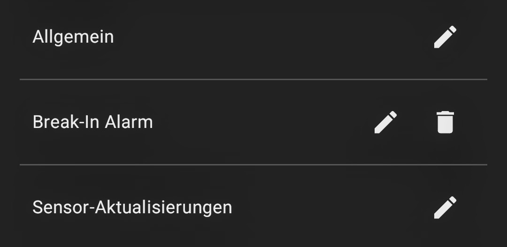
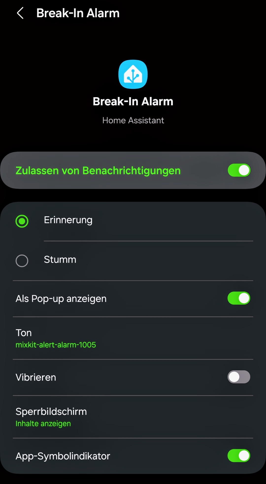
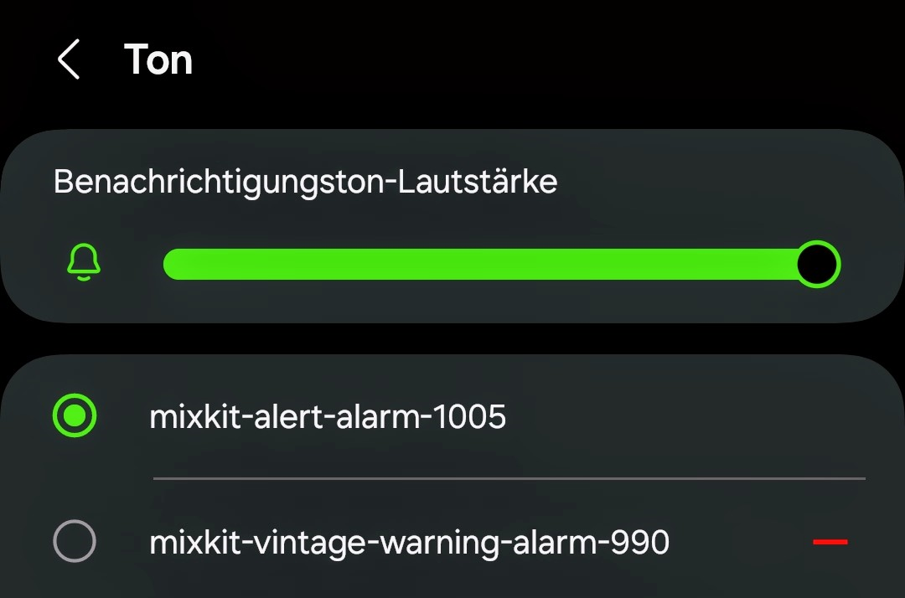

# HAOS Geofencing Alarm

A fully automated Home Assistant alarm system based on geofencing, designed for two or more users. The system uses Home Assistant for automation and location tracking. It integrates with geofencing tools like OwnTracks or GPSLogger. The alarm activates when everyone leaves home and deactivates when someone returns. It includes a manual override for cases like guests staying over or children being home alone.

## Table of Contents

- [HAOS Geofencing Alarm](#haos-geofencing-alarm)
  - [Table of Contents](#table-of-contents)
  - [Features](#features)
  - [Requirements](#requirements)
    - [Presence Tracking](#presence-tracking)
    - [Manual Override](#manual-override)
  - [Installation \& Setup](#installation--setup)
  - [Customization](#customization)
    - [Add More Users](#add-more-users)
    - [Modify Manual Override Behavior](#modify-manual-override-behavior)
    - [Customize Notifications](#customize-notifications)
  - [Intrusion Alert Helper](#intrusion-alert-helper)
  - [Automation](#automation)
    - [Alarm System Status Notification](#alarm-system-status-notification)
    - [Push Alarm for Person Detection](#push-alarm-for-person-detection)
  - [Dashboard](#dashboard)
  - [Custom Sound](#custom-sound)
  - [Contribution](#contribution)
  - [License](#license)

## Features

- Fully automated arming & disarming based on presence
- No external integrations (works with native Home Assistant)
- Manual override to enable or disable the alarm independently
- Scalable for multiple household members
- Minimal false triggers, only updates on actual status changes

## Requirements

### Presence Tracking

- At least one user with geofencing enabled via the Home Assistant mobile app.
- The system can be extended to support more users.

The Home Assistant Companion App allows for presence detection using both GPS and Wi-Fi connection. Enable the Wi-Fi Connection sensor in the app to detect presence based on your device's connection to your home Wi-Fi network.

### Manual Override

- An `input_boolean` toggle (`input_boolean.intrusion_alert`) to manually control the alarm.

Useful for cases like:
- Kids staying home alone
- Guests visiting
- Special exceptions (e.g., maintenance workers)

## Installation & Setup

1. Copy the YAML automation into Home Assistant → Automations.
2. Create input_boolean.intrusion_alert in Helpers.
3. Assign correct person entities in the YAML.

## Customization

### Add More Users

To add more users, extend the trigger and conditions in the automation YAML files. Ensure each user has geofencing enabled and is correctly referenced in the automations.

### Modify Manual Override Behavior

Adjust the behavior of the manual override by modifying the `input_boolean.intrusion_alert` settings. You can change how and when the manual override is activated or deactivated based on your specific needs.

### Customize Notifications

Customize notifications for different devices by modifying the notification settings in the automation YAML files. You can set different notification messages or methods (e.g., push notifications, emails) for each device or user.

## Intrusion Alert Helper

The Intrusion Alert helper is used to enable or disable the status for intrusion alerts. This allows you to see the status at any time and dynamically change it via the dashboard.

To set up the Intrusion Alert helper:

1. Navigate to **Settings** -> **Devices and services** -> **Helpers**.
2. Create a new helper called `input_boolean.intrusion_alert`.

## Automation

1. Navigate to **Settings** -> **Automations & Scenes**.
2. Click on the **Automations** tab.

### Alarm System Status Notification

Include the `alarm_system_status_notification.yml` file in your Home Assistant configuration.

This automation updates the status of the alarm system based on the presence of users. When everyone leaves home, it sets the alarm status to `on`. When someone returns, it sets the alarm status to `off`.

### Push Alarm for Person Detection

Include the `push_alarm_for_person_detection.yml` file in your Home Assistant automations.

This automation triggers a push notification when a person is detected by a camera. It ensures that you are alerted immediately if someone is detected while the alarm is active.

## Dashboard

To include the `security_camera_alert.yml` file from the `automations` directory in your dashboard, follow these steps:

1. Navigate to **Overview** -> **Edit Dashboard**.
2. Click on the **Add Card** button.
3. Select the **Manual** card type.
4. Copy the contents of the `security_camera_alert.yml` file and paste it into the card configuration.
5. Click **Save** to add the card to your dashboard.

This will allow you to view the status of the Intrusion Alert and disable it if needed via the dashboard.

## Custom Sound

The channel is created during the first execution of the `push_alert_for_person_detection` automation and can be customized to fit your needs.

To execute the script "Push Alert for Person Detection" manually, follow these steps:

1. Navigate to **Settings** -> **Automations & Scenes**.
2. Find the `Push Alert for Person Detection` automation.
3. Click on the **Run Actions** button to test the script.

This will create the notification channel if it doesn't already exist.

To customize the alarm sound, follow these steps:

1. Copy your custom sounds (e.g., inside the `sounds` directory) to your device's internal storage under `Notifications`.
2. Open the Home Assistant Companion app and navigate to **Settings** -> **Notifications** -> **Notification Channels**.
3. Select the **Break-in Alarm** channel.

1. Open the **Settings** for the **Break-in Alarm** channel.

1. Select your custom ringtone.
2. Adjust the volume as needed.

## Contribution
Contributions to enhance this project are welcome! If you have suggestions, improvements, or bug fixes, please open an issue or submit a pull request.

## License

This project is licensed under the terms of the MIT License. See the [LICENSE](LICENSE) file for more details.